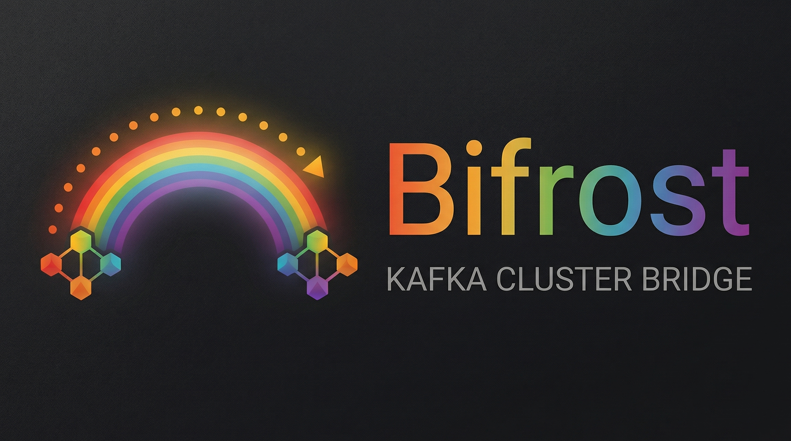

# bifrost



**bifrost** is a configurable Kafka replication service for moving records between topics and clusters using declarative YAML configurations. It is designed for teams that need a lightweight, operationally simple way to build reliable cross-cluster relay pipelines without writing custom consumer/producer code for every path.

**Observability**:

- **Logs:** Structured log lines (JSON or logfmt), written to stdout or stderr; optional attributes via `logging.fields.extra` (legacy `logging.extra_fields` when it does not conflict).
- **Metrics:** Prometheus scrape path `/metrics`. By default `metrics.listen_addr` is `:9090` (all interfaces) when metrics are enabled; override it in YAML. Scrape, for example, `http://127.0.0.1:9090/metrics`. Series include `bifrost_` application metrics plus standard `go_*` / `process_*` collector series.

**Runtime requirement:** at least one **Kafka-compatible** broker (Apache Kafka, Redpanda, etc.) reachable from the host or container running bifrost.

---

## Using the CLI

### Install or download

**Download prebuilt binaries:** [GitHub Releases](https://github.com/lolocompany/bifrost/releases) — the release workflow publishes cross-compiled `**bifrost`**binaries for Linux, macOS, and Windows (amd64 and arm64)** plus checksums.

**Install with the Go toolchain:**

```bash
go install github.com/lolocompany/bifrost/cmd/bifrost@latest
```

**Build from source:**

```bash
make build   # writes ./bifrost
# or
go build -o bifrost ./cmd/bifrost
```

### Running the CLI

```bash
./bifrost --config /path/to/bifrost.yaml
# or
./bifrost -c /path/to/bifrost.yaml
# or
BIFROST_CONFIG=/path/to/bifrost.yaml ./bifrost
```

If you omit `**--config**` / `**-c**` and do not set `**BIFROST_CONFIG**`, the default path is `**bifrost.yaml**` in the **current working directory**. If that file is missing or invalid, bifrost exits with an error.

### Docker

Release images are built by [GoReleaser](https://goreleaser.com/) (`dockers_v2`) from [`goreleaser/Dockerfile`](./goreleaser/Dockerfile). To **build locally from source** without GoReleaser, use [Dockerfile.build](./Dockerfile.build) (for example `make build-docker`).

The image runs `bifrost` with working directory `/home/bifrost`. **When using this image, prefer setting `BIFROST_CONFIG`** to the path of your YAML inside the container (for example after bind-mounting or copying the file). That keeps the config location explicit and avoids relying on default filenames or extra container command arguments.

```bash
docker run --rm \
  -e BIFROST_CONFIG=/home/bifrost/bifrost.yaml \
  -v bifrost.yaml:/home/bifrost/bifrost.yaml:ro \
  ghcr.io/lolocompany/bifrost:latest
```

Replace the image tag with the version you pull from [GitHub Releases](https://github.com/lolocompany/bifrost/releases) (the release workflow publishes the container to GHCR alongside the binaries).

### Config example

A full multi-cluster example lives in `[example.config.yaml](./example.config.yaml)`. Minimal shape:

```yaml
clusters:
  dev:
    brokers:
      - '127.0.0.1:9092'
  prod:
    brokers:
      - '127.0.0.1:9094'

bridges:
  - name: a-to-b
    from:
      cluster: dev
      topic: incoming
    to:
      cluster: prod
      topic: outgoing
    # Optional bridge-local relay batching. Defaults to 1 (disabled).
    # batch_size: 1
    # Optional concurrent produce depth per relay replica. Defaults to 64.
    # max_in_flight_batches: 64
    # Optional interval-based commit coalescing. Defaults to 1s.
    # commit_interval: "1s"
    # Optional size-based commit coalescing. Defaults to 1024.
    # commit_max_records: 1024
    # Optional fixed destination partition override. When omitted, bifrost preserves
    # the source partition number on each record. If set, the destination topic
    # must contain that partition index.
    # override_partition: 0
    # Optional fixed key override applied to every produced record for this bridge.
    # override_key: "static-key"
```

### Throughput-friendly defaults

Bifrost defaults are intentionally elastic: low overhead at idle, but ready to scale under load.

- Bridge defaults:
  - `max_in_flight_batches: 64`
  - `commit_interval: 1s`
  - `commit_max_records: 1024`
- Producer defaults:
  - `producer.required_acks: leader`
  - `producer.disable_idempotent_write: true`
- For stronger durability guarantees, prefer `producer.required_acks: all` and keep idempotence enabled (`disable_idempotent_write: false`).
- For higher throughput tuning, prefer:
  - `producer.linger: "5ms"`
  - `producer.batch_compression: "snappy"` (or `zstd` for better compression ratio)
  - `producer.batch_max_bytes` sized for your largest expected records
  - `consumer.fetch_max_bytes` and `consumer.fetch_max_partition_bytes` sized for your record profile.

### Relay failure handling

Bridge stages do not all fail the process the same way:

- `poll fetches` errors are counted, logged, and retried immediately with no backoff.
- Destination `produce` failures retry the same record or source-partition batch in-place with exponential backoff plus additive jitter.
- Source offset `commit` failures retry the same commit in-place with exponential backoff plus additive jitter.
- Unexpected source-topic mismatches are treated as fatal and stop the bridge.

Produce and commit retries are configured per cluster:

```yaml
clusters:
  source:
    consumer:
      commit_retry:
        min_backoff: '1s'
        max_backoff: '30s'
        jitter: '250ms'
  destination:
    producer:
      retry:
        min_backoff: '1s'
        max_backoff: '30s'
        jitter: '250ms'
```

If you omit these blocks, bifrost uses the same defaults shown above. Commit retries happen after a successful produce and retry the commit itself rather than re-producing the record, which reduces duplicate writes when Kafka acknowledges the produce but the offset commit fails.

### Development

| Command                      | Purpose                                                                                                                             |
| ---------------------------- | ----------------------------------------------------------------------------------------------------------------------------------- |
| `make build`                 | Build `./bifrost` from source                                                                                                       |
| `make test`                  | Run unit tests (`./cmd/... ./internal/...`)                                                                                         |
| `make test-integration`      | Run Docker-backed integration tests (`BIFROST_INTEGRATION=1`)                                                                       |
| `make bench`                 | Default subset; **one Redpanda container per benchmark** (isolated; slower than shared broker)                                      |
| `make lint`                  | Run `go vet`, `go mod verify`, `govulncheck`, `gosec`, and `golangci-lint`                                                          |
| `make lint`                  | Run vet, module verify, static/security/style checks (`staticcheck`, `govulncheck`, `gosec`, `golangci-lint`, `errcheck`, `revive`) |
| `make codequality-scorecard` | Generate codequality scorecard (`reports/codequality/scorecard.{json,md}`)                                                          |
| `make codequality-baseline`  | Capture/refresh codequality baseline for regression gates                                                                           |
| `make codequality-gate`      | Enforce codequality regression + severe outlier gates                                                                               |
| `make test-unit`             | Run unit tests (`./cmd/... ./internal/...`)                                                                                         |
| `make test-race`             | Run unit tests with race detector (`./cmd/... ./internal/...`)                                                                      |
| `make format`                | Run `go fmt` and `gofmt`                                                                                                            |

Bifrost is a CLI/service-first repository, not a supported Go library API. Product code lives under `internal/`: `app` composes process wiring, `domain/relay` owns consume -> produce -> commit behavior, `integrations/kafka` adapts Franz-go, and `observability/*` owns logging and metrics.

Contributor and agent-oriented notes on layout and naming: `[docs/AGENTS.md](./docs/AGENTS.md)`.
Configuration profiles and tradeoffs: `[docs/config-profiles.md](./docs/config-profiles.md)`.
Codequality policy and governance: `[.cursor/docs/codequality.md](./.cursor/docs/codequality.md)` and `[.cursor/docs/maintainability-governance.md](./.cursor/docs/maintainability-governance.md)`.

---

## Downstream deduplication (headers)

Relayed records include **bifrost-owned headers** so consumers can treat deliveries as **at-least-once** and dedupe. Configure per bridge under **`headers`** (see `example.config.yaml`).

| Setting | Role |
| :-- | :-- |
| **`headers.source.enabled`** | When true (default), emit metadata headers. When false, omit bifrost source/course headers entirely. |
| **`headers.source.format`** | `compact` (default): only **`bifrost.course.hash`** — opaque **32-byte SHA-256** over a canonical preimage of `(from cluster, source topic, partition, offset)`. `verbose`: same hash **plus** the four **`bifrost.source.*`** headers below (parseable coordinates). |
| **`headers.propagate`** | When true (default), append headers from each **source** Kafka record after bifrost/config extras. When false, source record headers are not copied. |
| **`headers.extra`** | Optional string map of extra headers (sorted on the wire). Keys must not use the `bifrost.*` prefix. Deprecated alias: top-level **`extra_headers`** (must not disagree with `headers.extra`). |

**Compact wire footprint:** `bifrost.course.hash` key (19 bytes UTF-8) + 32-byte value = **51 bytes** fixed — smaller than the four `bifrost.source.*` headers for typical cluster/topic names. Treat the hash value as **opaque**; dedupe by **byte equality** (or hash the value in your app).

**Verbose structured headers** (only when `headers.source.format: verbose`; always **after** `bifrost.course.hash`):

| Header | Value |
| :-- | :-- |
| `bifrost.source.cluster` | Source cluster name (UTF-8) |
| `bifrost.source.topic` | Source topic name (UTF-8) |
| `bifrost.source.partition` | Source partition, **4 bytes big-endian unsigned** |
| `bifrost.source.offset` | Source offset, **8 bytes big-endian unsigned** |

**Idempotency:** prefer deduping on **`bifrost.course.hash`** (stable across relay instances). With verbose mode you can alternatively key on `(cluster, topic, partition, offset)` from the structured headers.

Partition preservation, `override_partition`, `override_key`, and `batch_size` behave as before (see earlier sections).

---

## Metrics

When `metrics.enabled` is true (default), bifrost serves Prometheus metrics on `/metrics` at `metrics.listen_addr` (default `:9090`).

The metrics endpoint is unauthenticated. Bind it to a trusted interface or restrict network access before exposing bifrost outside local or private infrastructure.

Core `bifrost_relay_`\* bridge metrics are always exported when metrics are enabled. Optional families are controlled by `metrics.groups` (default enabled when omitted):

- `kafka` — broker hook metrics per cluster (connect, E2E bytes/errors/latency, throttling)
- `tls` — TLS handshake and peer certificate metrics per cluster
- `golang`, `process`, `tcp` — runtime/platform collectors

Application metric names are prefixed with `bifrost_`; runtime collector metrics keep standard names (`go_*`, `process_*`). You can also set `metrics.labels.extra` (legacy `metrics.extra_labels` still accepted when it does not conflict) to attach constant labels to all exported series.

For full metric-by-metric tables (name, labels, explanation), see [Metrics Deep Dive](./docs/metrics.md).
